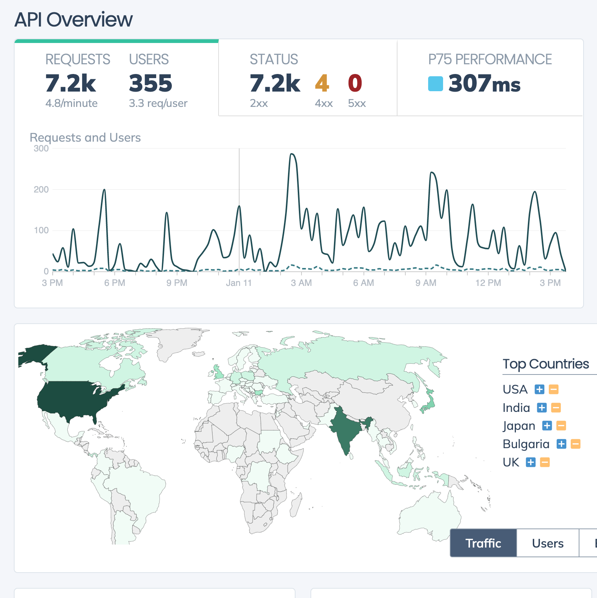
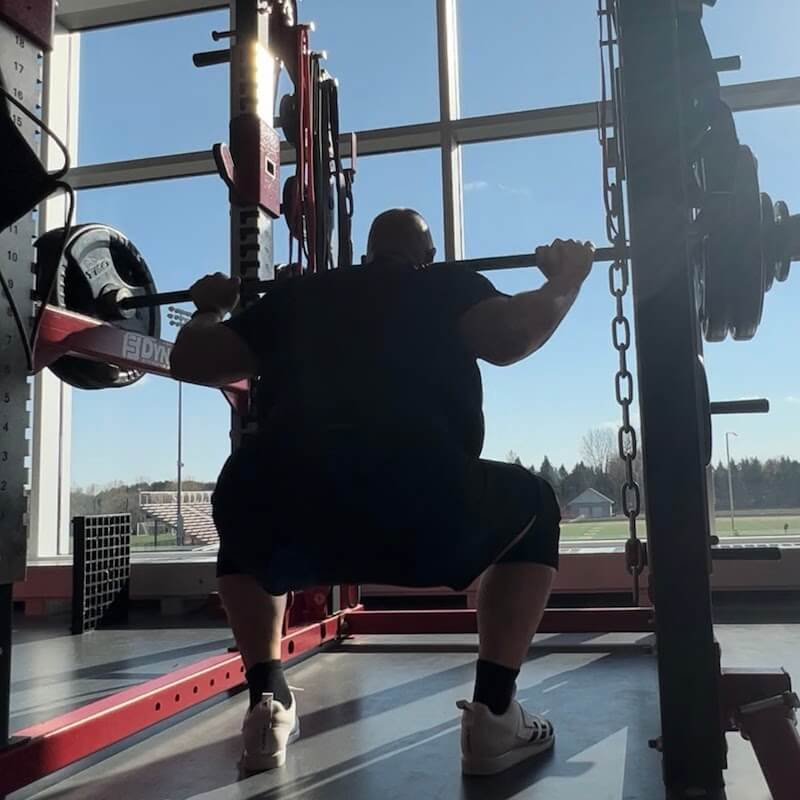
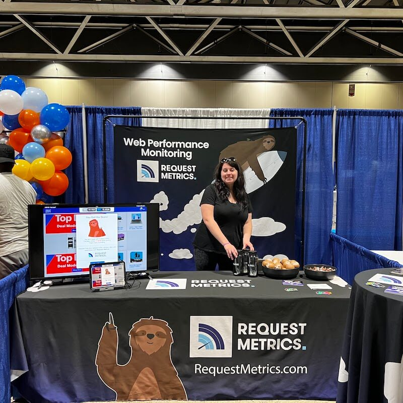

import YouTubeVideo from '/src/components/YouTubeVideo.astro';

The first of (hopefully) a new series of video updates about the web, observability, and my businesses. I had to shut down my Revue-based newsletter, which was honestly difficult to keep up with because writing is hard. Video is way more fun!

In the first update, I give a quick recap of 2022: how [TrackJS](https://trackjs.com/) did, what we are doing with [Request Metrics](https://requestmetrics.com/), and getting back to conferencing.

<YouTubeVideo videoId='_O-7xDzdWrU' videoTitle={frontmatter.title} />

After a long hiatus on my newsletter and an even longer hiatus on my blog I decided to come back and do some more video week content than I'd done before.

I've done [video streams for Request Metrics](https://www.youtube.com/@RequestMetrics), but I'd never really done it as like a personal one. I figure it's probably gonna be easier for me than writing, because writing is hard! With video, we just get to hang out, drink coffee, and pretend we're all working.

## Growing TrackJS
It was a good year for me and for my businesses and a lot of really cool stuff happened with [TrackJS](https://trackjs.com), the JavaScript error monitoring software as a service product that I've been running for the last nine years.

We grew up through the renaissance of JavaScript and have seen how good and how bad JavaScript can be. Last year we captured just under a *billion errors* from our customers. Developers that sign up drop the error rate by more than 10% in the first month. It's awesome that we get to help so many people fix things and make the web better.

Looking at some of our data there, `script error` remains the top error across our entire data set, which is funny because it is the least useful error that occurs. It is a obfuscation of data that browsers hide a real error because it happened to happen or it happened to occur on a different origin than what your main page is on. I've written a bunch of stuff about [Script Error and how to fix it](https://trackjs.com/blog/script-error-javascript-forensics/). I even did a whole conference talk about that back in the day.

Over this last year, we launched a bunch of improvements. We launched a new SSO system for our our  enterprise customers. We changed over to a new version of Stripe billing. The billing code was some of our oldest and grossest code, it had been around since the beginning. It we good to get that cleaned out.

We started switching the product over to .NET Core, which has been very exciting. We learned a lot about running .NET core from Request Metrics. There's a long road on that still, as some of our dependencies have changed significantly over the years. We haven't switched completely, but hopefully soon it'd be great not to depend on Windows servers anymore.

## Building and Rebuilding Request Metrics

The second thing that we did this year was we launched (and started relaunching) our second product [Request Metrics](https://requestmetrics.com/).

In 2020, we started building out our web performance monitoring tool called Request Metrics. We were all home with the pandemic and thought, "Hey, we should take our time and do this." We built a bunch of videos around that that are available out on the internet. [We recorded all of our development sessions in building that product](https://requestmetrics.com/building/) out which was super fun to do and we gotta like talk to a bunch of interesting people along the way.

In 2021, the product grew modestly, but not quite as well as we'd hoped. The performance data we captured were super interesting and unique, but customers wanted to be able to dig into data more than we could offer.

We were doing everything with aggregate data in order to keep our costs and the price of the service very, very low. Customers wanted to dig in more than they could to understand when we were reporting that a page was slow, why was it slow? And, and we couldn't do that with aggregate data.

And they also wanted to know the context of when a page is slow or when, you know, one of the web vitals is showing in a poor state, what was it affecting? Was their conversion rate falling or something like that. And we couldn't really do either of those things with either the pricing model that we had launched with or the fundamental data model.

And so we made the decision that we needed to re-scope the product to answer these questions and really kind of expand into a new area that we're calling client side observability. Which is an exciting time because like there's a lot of other vendors like Grafana and Honeycomb that seem to be talking about that as well.

So we feel like, hey, maybe we're riding the wave of something. And I think, I think it's really cool because what we can do is rather than taking this data and aggregating it together, we're gonna keep each individual page view, each individual set of data about what the users are doing, what they're calling, and we're gonna be able to observe the complete experience of the end user.

I'm really excited about this. I think this is going to be a cool perspective because we can monitor the place or we can monitor our systems where it's most relevant, the end user's perspective on the system is, is really the source of truth.

There's a long way to go in that. I'll be talking a bunch more about that in 2023. I'm sure we're gonna be flushing out that product more figuring out how we're gonna price it and how we're gonna go to market with it and all kinds of stuff like that.

## Getting Strong and Lifting Heavy

Late in 2021 and through all of 2022, I have been getting into weightlifting, like lifting heavy with an app called [Strong Lifts 5x5](https://stronglifts.com/5x5/), where it gives me three full body lifts to do, 3 times a week.

It's been amazing. Like it has been the most productive exercise routine I have ever been on.
And and over the last year I've dropped like 80 pounds and largely kept that off for that entire amount of time with a little ebb and flow as I put on new, new kinds of muscle that I've never had before. My squat PR is up to 265 pounds for 25 reps, which is staggering to me.

## Conferencing and making it a Family Business

I got back on the road again this year, visiting conferences in London, Oslo, Minneapolis, and Kansas City. My family came with on some of them. We hit [KCDC](https://www.kcdc.info/), which is a fantastic event, and my wife and daughter helped me work a booth for Request Metrics.

I loved showing my daughter what I actually do for work. Like for as long as she's been kind of aware of things. I've worked from home, I've worked outta my home office, and as like dad didn't have a job. And so it was great to actually show her that I do have a job, that this is what I do, and that like, there's a ton of possibilities out there for her.
