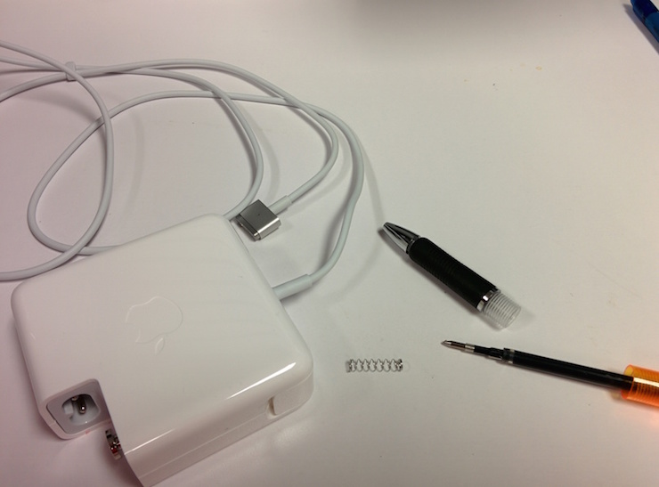
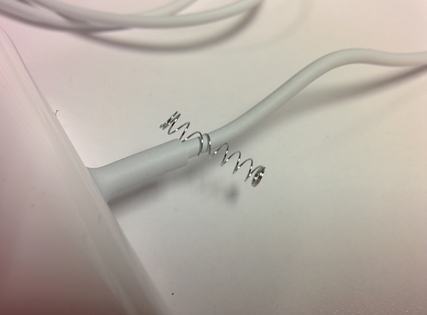
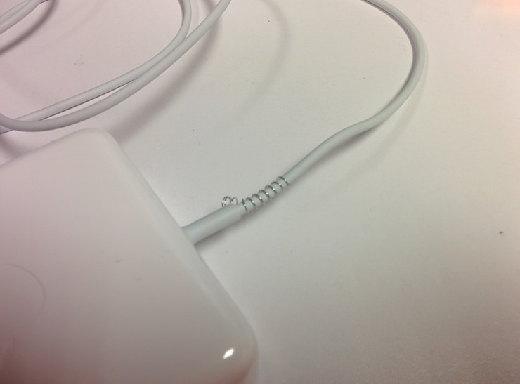
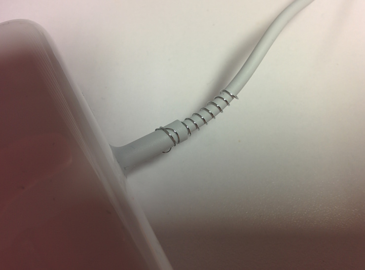
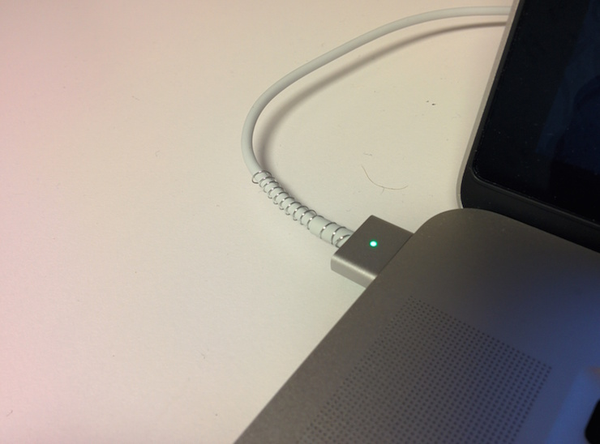

I just purchased a new 2015 Macbook Pro, which is fantastic. The first brand of computer that I've ever purchased more than once. But they have a major flaw: the Power Adapter cords. Maybe I'm just too rough with them, but they tear and fray on me around the ends.

These cables aren't cheap, so one of the first things I did after unboxing was to reinforce the cables. It's a quick hack that you can do with a few extra clicky-pens you have laying about.

First, get the springs out of two clicky-pens for the two ends of the power cable. Also remember to disconnect the cable from power so you don't get an accidental shock.

Take one spring and push a gap about halfway into the spring onto the cable next to one end, below the neck. Note the turn of the spring and carefully wind with the turn down the length of the cable.

When you get to the end of the spring, you may need a pliers to get the last bit wrapped. Be sure to get the end gripping tight, it may dig a bit into the plastic, which will hold it in place.

Take the unwound end of the spring and wind it over the neck. If you can get at least one turn of the spring over the neck, you can "screw" the spring on fully. Try to get the spring as close to the end as possible.

Repeat for the other side, and enjoy an better tensioned cable with fewer tears.
